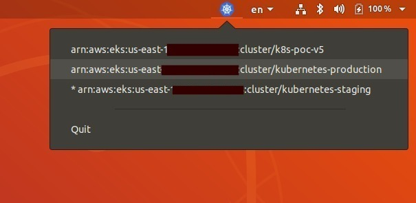

# k8s-cluster-switcher-ubuntu-indicator

## Switch K8S Clusters using the UI



# prerequisite

* install [kubectl](https://kubernetes.io/docs/tasks/tools/install-kubectl/)
* for the UI ```sudo apt install libappindicator3-dev```

# Installation: 

1. Clone this repo 
```
git clone https://github.com/Isan-Rivkin/k8s-cluster-switcher-ubuntu-indicator.git
```

2. Run the makefile: 

```
make PROJECT_DIR='path/to/project/dir'
```
